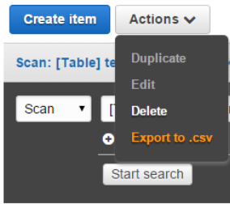

# csv2dynamo



reimport csv from export function of aws DynamoDB

# install

```
go get github.com/maito1201/csv2dynamo/cmd/csv2dynamo
```

# usage

```
csv2dynamo [options]
```

```
NAME:
   csv2dynamo - reimport csv from export function of aws DynamoDB

USAGE:
   main.exe [global options] command [command options] [arguments...]

COMMANDS:
   help, h  Shows a list of commands or help for one command

GLOBAL OPTIONS:
   --file value, -f value        file to import e.g ./tablename.csv (required)
   --table-name value, -t value  target dynamo db tabe name (required)
   --endpoint value, -e value    endpoint of DynamoDB
   --profile value, -p value     profile of aws cli
   --output value, -o value      target output (default: stdout), no file will be created if execute option is enabled
   --execute                     is directly execute import command (default: false)
   --help, -h                    show help (default: false)
```

# example

```
csv2dynamo --table-name sample-table --file ./testdata/sample.csv

read and compile csv
progress: 2/2
complete!
aws dynamodb put-item --table-name sample-table --item {"s_value":{"S":"sample1"},"n_value":{"N":"1"},"bool_value":{"B":true}}
aws dynamodb put-item --table-name sample-table --item {"s_value":{"S":"sample2"},"n_value":{"N":"2"},"bool_value":{"B":false}}
```

# caution

This CLI may not work well with complex table condition(e.g: Table that the data format of the attributes is not unified for each record)
